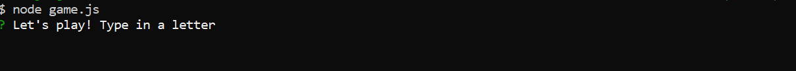
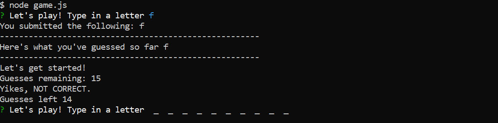
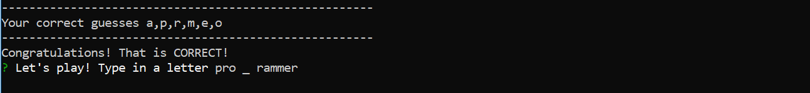

# Command Line Constructor Word Guess 

June 2019

## About the Constructor Word Guess

The following application utilizes node.js and constructors to modularize the application. 

The app deploys in the Node.js environment. Output is viewed on the command prompt/ command line/ PowerShell etc.,

## Running the Application

The application begins when running node game.js. The file game.js holds the main logic for the application. The main file game.js communicates with the other js files, letter.js and word.js.


```
node game.js
```

## Screenshots of the terminal / bash window output

###### Output initializing game


###### Determining first guess and counting down


###### Mid-game snapshot and informing user of correct guesses



